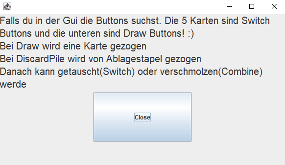
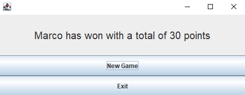

# Silver

This is our Project for the course Software Engineering.
 
We recreated the Game Silver and made our own version based on the original.
 
By **Marco Mollo** and **Heiko Schmid**

## Description
At the start of the game you have five Cards laying in front of you, the first two are faced up so you can look at them.
 
Make sure you remember them because after the first round they are going to be covered.
 
 
After that the fun begins.
  
Each round you can change one of your cards with one from the deck or discard pile, then you have to smartly switch to get the lowest point value possible, which would be 0.
 
If you have two of the same cards you can combine them and switch both of them with the drawn card. In this case the card
13 is a Joker, it can be combined with any other card.
 
If you'r not sure you rememberd the card correctly you have the option to look at one card, but then 
you can't draw a new card that round.
 
Say Cabo when you think you have fewer points then the other players. 
 
The goal of this game is to have the fewest Points at the end, which determines the winner.
 
Have fun playing our little Project :)

## GameField

## Coverage of our Project without GUI

## Coverage of our Project with GUI

## Bugs & Fixes
If you find any Bugs feel free to Contact us, so we can fix them or try to fix it by yourself and send us the fix.
 
And we will mention you as a Contributor.

## License
[MIT](https://choosealicense.com/licenses/mit/)