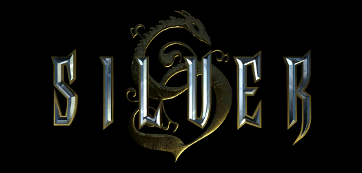
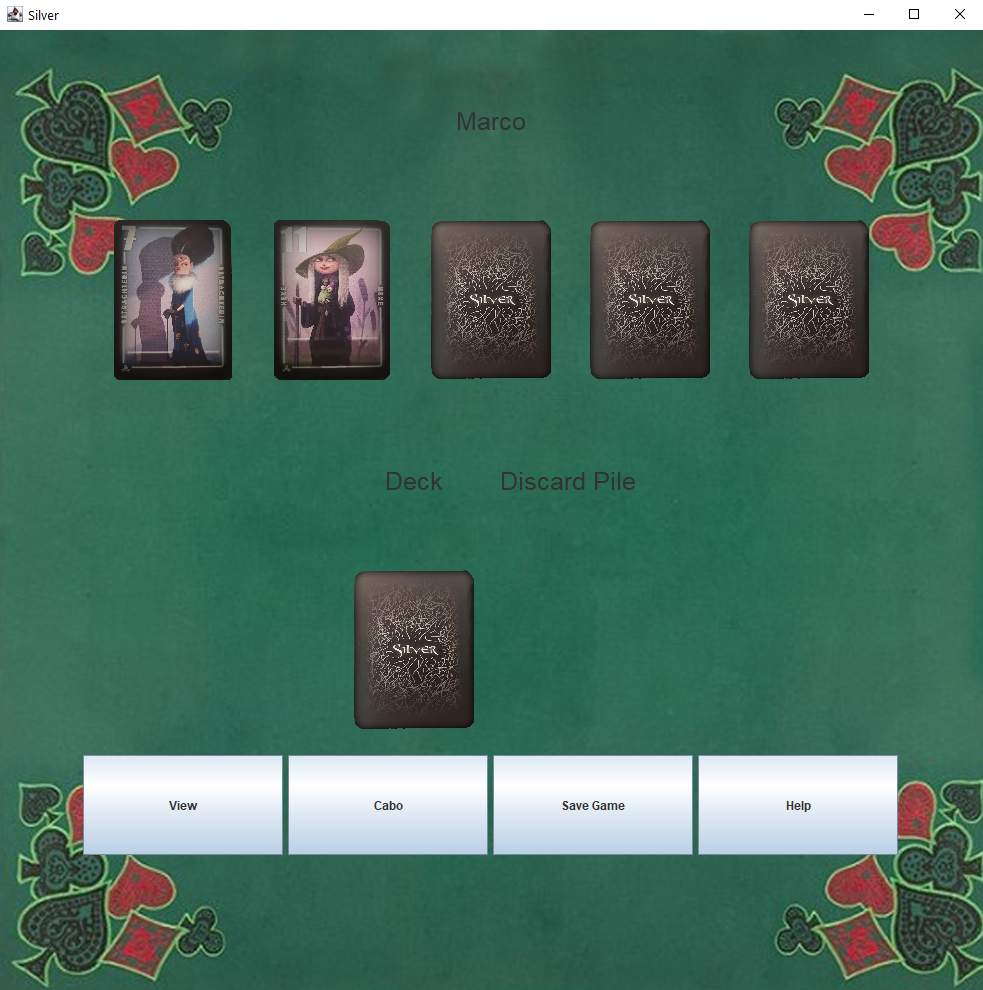

# Silver

This is our Project for the course Software Engineering.
 
We recreated the Game Silver and made our own version based on the original.
 
By **Marco Mollo** and **Heiko Schmid**

## Description
At the start of each round you have five covered Cards laying in front of you, which the first two you can look at. 
 
 
After that the fun begins.
  
You can change your own cards with the ones from the deck or discard pile, then you have to smartly switch and combine
your cards, and say Cabo when you think you have fewer points then the other players. 
 
The goal of this game is to have the fewest Points at the end, which determines the winner.

## GameField

## Coverage of our Project

## License
[MIT](https://choosealicense.com/licenses/mit/)